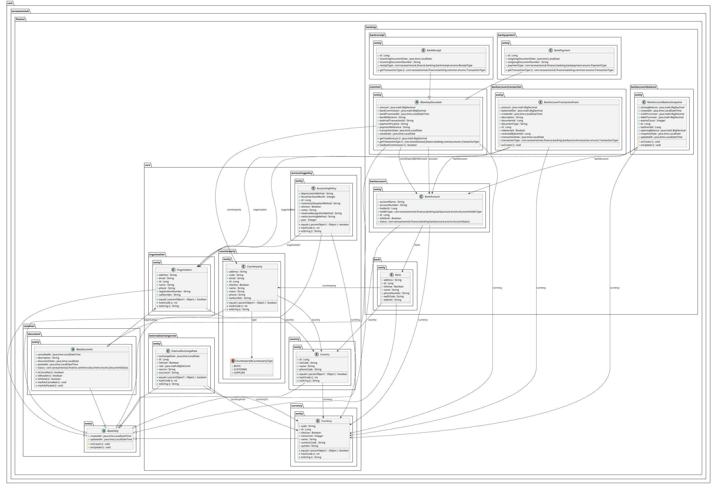
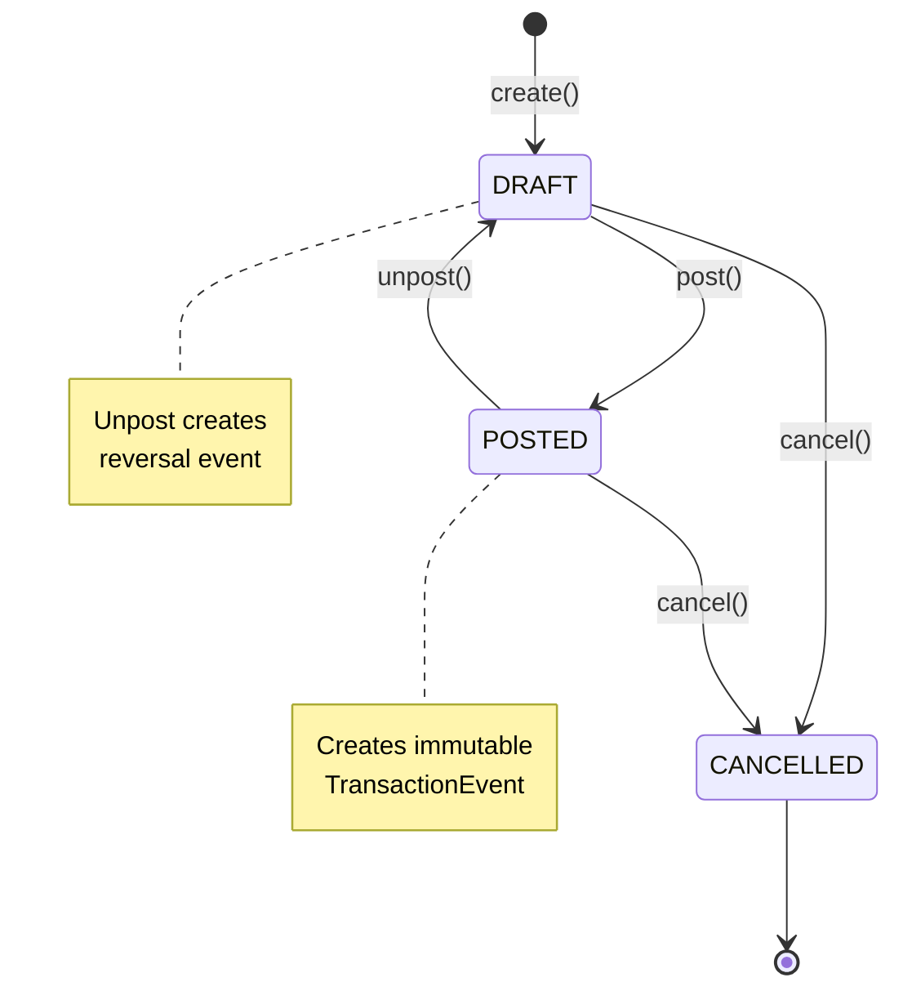
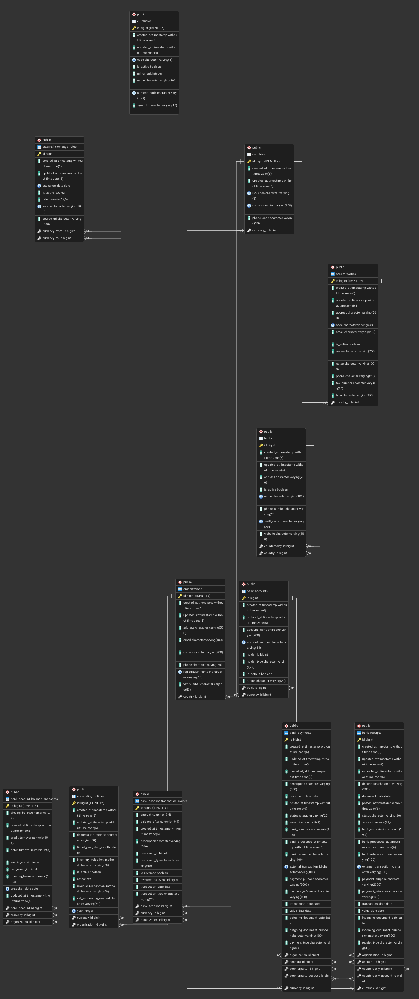

# System Architecture

## Overview

**Modular monolith** with clear separation between foundation (Core) and business logic (Banking).

### Key Principles

- **Unidirectional Dependency** — Banking depends on Core, Core is independent
- **Event Sourcing** — Immutable audit trail for all banking transactions
- **Clean Architecture** — Layered structure (entity → repository → service → controller)

---

## Module Structure
```
com.tarasantoniuk.finance
│
├── common/                   (Shared Infrastructure)
│   ├── entity/BaseEntity    createdAt, updatedAt
│   ├── document/BaseDocument documentDate, status, organization
│   └── config/              JPA auditing, Swagger, exceptions
│
├── core/                    (Foundation Module - Independent)
│   ├── country/             Country registry
│   ├── organization/        Multi-organization support
│   ├── counterparty/        Customer/supplier registry
│   ├── currency/            ISO 4217 currencies
│   ├── accountingpolicy/    Fiscal year policies
│   └── externalexchangerate/ ECB integration + exchange rates
│       └── source/ecb/      ECBScheduler, ECBClient, ECBSyncService
│
└── banking/                 (Transaction Module - Depends on Core)
    ├── common/
    │   └── entity/MonetaryDocument  Abstract base for payments
    ├── bank/                Bank registry
    ├── bankaccount/         Multi-currency accounts
    ├── bankreceipt/         Incoming payments (10+ types)
    ├── bankpayment/         Outgoing payments (10+ types)
    ├── bankaccounttransaction/  Event Store (immutable)
    ├── bankaccountbalance/  Balance snapshots (cache)
    └── report/              Financial reports
```

### Module Dependencies
```
Banking Module
    ↓ uses
Core Module (Country, Organization, Counterparty, Currency, AccountingPolicy, ExternalExchangeRate)
    ↓ uses
Common Infrastructure (BaseEntity, BaseDocument)
```

**Rule**: Banking → Core → Common (unidirectional only)

---

## Domain Model



*[View PlantUML source](uml/domain-model.puml)*

### Entity Hierarchy
```
BaseEntity (audit fields)
    ↓
BaseDocument (lifecycle: DRAFT → POSTED → CANCELLED)
    ↓
MonetaryDocument (amount, currency, counterparty)
    ├── BankReceipt (incoming payments)
    └── BankPayment (outgoing payments)

BankAccountTransactionEvent (immutable Event Store)
BankAccountBalanceSnapshot (performance cache)
```

### Key Entities

**Core Module (Foundation):**
- `Country` — Country registry with ISO codes and currency references
- `Organization` — Multi-tenancy support with registration details
- `Counterparty` — Customer/supplier registry with tax identification
- `Currency` — ISO 4217 codes, symbols, minor units (decimal precision)
- `AccountingPolicy` — Fiscal year policies per organization
- `ExternalExchangeRate` — Daily rates from ECB (190k+ records)

**Banking Module (Transactions):**
- `Bank` — Bank registry with SWIFT codes
- `BankAccount` — Multi-currency accounts
- `BankReceipt` — 10+ receipt types (CUSTOMER_PAYMENT, LOAN_RECEIVED, etc.)
- `BankPayment` — 10+ payment types (SUPPLIER_PAYMENT, SALARY, TAX_PAYMENT, etc.)
- `BankAccountTransactionEvent` — Immutable event log (Event Store)
- `BankAccountBalanceSnapshot` — Optimization cache

---

## Core Module: Foundation Entities

The Core module provides reusable foundation entities used across the entire system.

### Key Components

**Geographic & Organizational:**
- Country registry with ISO codes
- Multi-organization support for multi-tenancy
- Organization registration details (VAT, tax numbers)
- Accounting policies per organization (fiscal year configuration)

**Business Partners:**
- Counterparty registry (customers, suppliers, or both)
- Contact information and tax identification
- Active/inactive status management

**Currency Management:**
- ISO 4217 compliant currency registry (40+ currencies)
- Currency codes, symbols, minor units (decimal precision)
- Active/inactive status tracking

**Exchange Rate Integration:**
- External exchange rate storage (190k+ historical records)
- Multiple source support (currently: ECB)
- Date-based rate queries
- Cross-currency rate calculations

### ECB Integration (Automated Exchange Rates)

**Architecture:**
```
ECBScheduler (@Scheduled: 0 5 16 * * *)
    ↓
ECBClient (HTTP GET XML feed)
    ↓
ECBSyncService (parse XML → bulk insert)
    ↓
ExternalExchangeRate (190k+ records)
```

**How It Works:**

1. **Daily Trigger** — Scheduled job runs at 16:05 CET (after ECB publishes rates)
2. **Download XML** — Fetch exchange rate feed from ECB endpoint
3. **Parse & Validate** — Extract 40+ currency rates, validate data
4. **Bulk Insert** — Save to database (idempotent, duplicate prevention)
5. **API Access** — Rates available via REST API immediately

**Key Features:**
- Idempotent loading (won't create duplicates)
- Error handling with retry logic
- Transaction safety (all-or-nothing)
- Historical data preserved (append-only)

**Live Demo**: https://tarasantoniuk.com/exchange-rates.html

---

## Banking Module: Event Sourcing

### Architecture
```
User creates BankReceipt (DRAFT)
    ↓
User posts document
    ↓
BankReceiptService.post()
    ↓
BankAccountTransactionService.createEvent()
    ↓
BankAccountTransactionEvent (immutable, saved to DB)
    ↓
Balance calculated and stored in event
```

### Event Sourcing Pattern

**Event Store:** `BankAccountTransactionEvent`
- Immutable — created once, never updated or deleted
- Append-only — new events added to end of log
- Complete audit trail — every transaction recorded

**Event Fields:**
- `bankAccount`, `organization`, `currency` — context
- `transactionType` (DEBIT/CREDIT), `amount` — what happened
- `documentType`, `documentId` — source document
- `balanceAfter` — calculated balance after event
- `isReversed`, `reversedByEventId` — reversal tracking

### Document Lifecycle


**State Transitions:**
- `DRAFT` — Document editable, no events created
- `POST` → `POSTED` — Creates immutable event, balance updated
- `UNPOST` → `DRAFT` — Creates reversal event (does NOT delete original)
- `CANCEL` — Marks document as cancelled (events remain)

### Balance Calculation

**Real-time from events:**
```
Balance = Previous Balance + Amount (CREDIT) - Amount (DEBIT)
```

**Balance Snapshots** (optional optimization):
- Calculated on-demand for reporting
- Fields: `openingBalance`, `debitTurnover`, `creditTurnover`, `closingBalance`
- Cached for performance

---

## Design Decisions

### Why Event Sourcing?

✅ **Complete Audit Trail** — Every transaction recorded, immutable  
✅ **Regulatory Compliance** — Financial audit requirements  
✅ **Temporal Queries** — Balance as of any date  
✅ **Reversal Support** — Unpost without deleting history

### Why Modular Monolith?

✅ **Simplicity** — Single deployable unit, easier development  
✅ **Clear Boundaries** — Modules can become microservices later  
✅ **Performance** — No network overhead between modules

### Trade-offs

**Pros:**
- Complete transaction history
- Easy debugging (event log)
- Time-travel queries

**Cons:**
- Event store grows over time (mitigated with snapshots)
- More complex than CRUD
- Learning curve for developers

---

## Database Schema

### Entity-Relationship Diagram



*Generated from PostgreSQL 17 database schema*

### Key Tables

**Core Module:**
- `countries` — Country registry with ISO codes
- `organizations` — Multi-tenancy with registration details
- `counterparties` — Customer/supplier registry
- `currencies` — ISO 4217 currency registry
- `accounting_policies` — Fiscal year policies
- `external_exchange_rates` — 190k+ historical rates

**Banking Module:**
- `banks` — Bank registry with SWIFT codes
- `bank_accounts` — Multi-currency accounts
- `bank_receipts` — Incoming payment documents
- `bank_payments` — Outgoing payment documents
- `bank_account_transaction_events` — Event Store (append-only) ⭐
- `bank_account_balance_snapshots` — Performance cache

### Event Store Table

`bank_account_transaction_events` — Core of Event Sourcing architecture:
- Append-only (no updates or deletes)
- Complete audit trail
- Fields: `bank_account_id`, `transaction_type`, `amount`, `balance_after`
- Reversal support: `is_reversed`, `reversed_by_event_id`

### Indexes Strategy

Strategic indexes for performance:
- `external_exchange_rates(currency_from_id, currency_to_id, exchange_date)` — Fast rate lookups
- `bank_account_transaction_events(bank_account_id, transaction_date)` — Event queries
- `bank_account_transaction_events(document_type, document_id)` — Document tracking
- `bank_receipts(status, organization_id)` — Filtered lists
- `bank_payments(status, organization_id)` — Filtered lists
- `bank_accounts(holder_type, holder_id)` — Polymorphic holder queries

### Sequences

PostgreSQL sequences for ID generation:
- `bank_receipt_id_seq` (allocationSize=50)
- `bank_payment_id_seq` (allocationSize=50)
- Synchronized after manual data imports

---

## API Structure

All endpoints documented in [Swagger UI](https://api.tarasantoniuk.com/swagger-ui/index.html)

**Core Module:**
- `/api/v1/countries`
- `/api/v1/organizations`
- `/api/v1/counterparties`
- `/api/v1/currencies`
- `/api/v1/accounting-policies`
- `/api/v1/exchange-rates`

**Banking Module:**
- `/api/v1/banks`
- `/api/v1/bank-accounts`
- `/api/v1/bank-receipts`
- `/api/v1/bank-payments`
- `/api/v1/banking/reports/account-balances`
- `/api/v1/banking/reports/account-turnovers`

---

**Version**: 0.0.5
**Last Updated**: January 2025