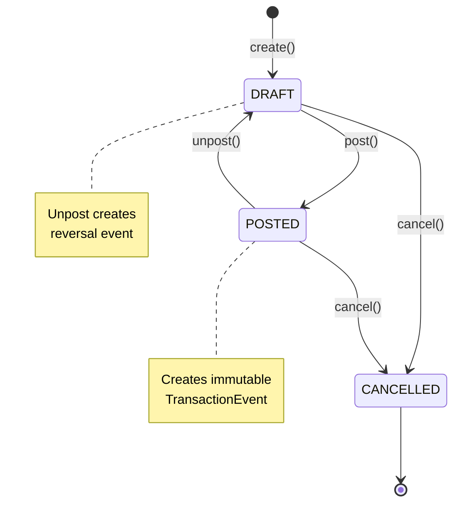

# System Architecture

## Overview

**Modular monolith** with clear separation between foundation (Core), business logic (Banking), and security (Security).

### Key Principles

- **Unidirectional Dependency** — Banking depends on Core, Core is independent
- **Event Sourcing** — Immutable audit trail for all banking transactions
- **Clean Architecture** — Layered structure (entity → repository → service → controller)
- **JWT Security** — Stateless authentication with role-based access control

---

## Module Structure
```
com.tarasantoniuk.finance
│
├── common/                   (Shared Infrastructure)
│   ├── entity/BaseEntity    createdAt, updatedAt, createdBy, updatedBy
│   ├── document/BaseDocument documentDate, status, organization
│   ├── config/              JPA auditing, Swagger, exceptions
│   ├── period/              Report period calculation
│   ├── snapshot/            Balance snapshot validity tracking
│   └── debug/               Health check endpoints
│
├── core/                    (Foundation Module - Independent)
│   ├── country/             Country registry
│   ├── organization/        Multi-organization support
│   ├── counterparty/        Customer/supplier registry
│   ├── currency/            ISO 4217 currencies + data loader
│   ├── accountingpolicy/    Fiscal year policies
│   └── externalexchangerate/ ECB integration + exchange rates
│       └── source/ecb/      ECBScheduler, ECBClient, ECBSyncService
│
├── banking/                 (Transaction Module - Depends on Core)
│   ├── common/
│   │   └── entity/MonetaryDocument  Abstract base for payments
│   ├── bank/                Bank registry
│   ├── bankaccount/         Multi-currency accounts
│   ├── bankreceipt/         Incoming payments (10+ types)
│   ├── bankpayment/         Outgoing payments (10+ types)
│   ├── bankaccounttransaction/  Event Store (immutable)
│   ├── bankaccountbalance/  Balance snapshots (cache + validity)
│   └── report/              Financial reports
│       ├── accountbalance/  Balance reports
│       └── accountturnover/ Turnover reports
│
└── security/                (Security Module - Cross-cutting)
    ├── auth/                Authentication (register, login, refresh, logout)
    ├── jwt/                 JWT token generation & validation
    ├── user/                User entity, admin management
    ├── token/               Refresh token storage & blacklist
    ├── config/              SecurityFilterChain, CORS, exception handlers
    └── audit/               Security event logging
```

### Module Dependencies
```
Security Module (cross-cutting, protects all endpoints)
    ↓
Banking Module
    ↓ uses
Core Module (Country, Organization, Counterparty, Currency, AccountingPolicy, ExternalExchangeRate)
    ↓ uses
Common Infrastructure (BaseEntity, BaseDocument, SnapshotValidity)
```

**Rule**: Banking → Core → Common (unidirectional only). Security is cross-cutting.

---

## Domain Model


*[View PlantUML source](uml/domain-model.puml)*

### Entity Hierarchy
```
BaseEntity (audit fields: createdAt, updatedAt, createdBy, updatedBy)
    ↓
BaseDocument (lifecycle: DRAFT → POSTED → CANCELLED)
    ↓
MonetaryDocument (amount, currency, counterparty)
    ├── BankReceipt (incoming payments)
    └── BankPayment (outgoing payments)

User (email, password, role, organization, lockout tracking)
RefreshToken (tokenHash, expiresAt, revoked, used)

BankAccountTransactionEvent (immutable Event Store)
BankAccountBalanceSnapshot (performance cache)
SnapshotValidity (validity tracking for snapshots)
```

### Key Entities

**Core Module (Foundation):**
- `Country` — Country registry with ISO codes and currency references
- `Organization` — Multi-tenancy support with registration details
- `Counterparty` — Customer/supplier registry with tax identification
- `Currency` — ISO 4217 codes, symbols, minor units (decimal precision)
- `AccountingPolicy` — Fiscal year policies per organization
- `ExternalExchangeRate` — Daily rates from ECB (190k+ records)

**Banking Module (Transactions):**
- `Bank` — Bank registry with SWIFT codes
- `BankAccount` — Multi-currency accounts with holder types (ORGANIZATION/COUNTERPARTY)
- `BankReceipt` — 10+ receipt types (CUSTOMER_PAYMENT, LOAN_RECEIVED, etc.)
- `BankPayment` — 10+ payment types (SUPPLIER_PAYMENT, SALARY, TAX_PAYMENT, etc.)
- `BankAccountTransactionEvent` — Immutable event log (Event Store)
- `BankAccountBalanceSnapshot` — Optimization cache with validity tracking

**Security Module (Authentication & Authorization):**
- `User` — Email (unique), encoded password, role (ADMIN/USER/GUEST), organization FK, lockout fields
- `RefreshToken` — Token hash, expiration, revoked/used flags

---

## Security Architecture

### Authentication Flow
```
Client                          Server
  |                               |
  |-- POST /api/auth/login ------>|
  |   {email, password}           |
  |                               |-- Validate credentials
  |                               |-- Check account lockout
  |                               |-- Generate JWT access token (15 min)
  |                               |-- Generate refresh token (7 days)
  |                               |-- Store refresh token hash in DB
  |                               |-- Publish audit event
  |<-- 200 {accessToken} ---------|
  |   Set-Cookie: refresh_token   |
  |   (HttpOnly, Secure, Strict)  |
  |                               |
  |-- GET /api/v1/... ----------->|
  |   Authorization: Bearer <jwt> |
  |                               |-- JwtAuthenticationFilter
  |                               |   1. Extract Bearer token
  |                               |   2. Validate signature (HMAC-SHA256)
  |                               |   3. Check blacklist (Caffeine cache)
  |                               |   4. Create JwtPrincipal
  |                               |   5. Set SecurityContext
  |<-- 200 response --------------|
```

### JWT Token Structure
- **Algorithm**: HMAC-SHA256
- **Access Token** (15 min): Claims include `jti`, `sub` (userId), `email`, `role`, `orgId`, `iss`
- **Refresh Token** (7 days): Stored as HttpOnly, Secure, SameSite=Strict cookie

### Security Filter Chains
1. **Swagger chain** (Order=1): Permits `/swagger-ui/**`, `/v3/api-docs/**`, `/actuator/health`
2. **Main API chain** (Order=2): Stateless JWT authentication

### Authorization Rules
| Endpoint Pattern | HTTP Method | Required Role |
|---|---|---|
| `/api/auth/*` (register, login, refresh) | POST | None (public) |
| `/api/auth/logout`, `/api/auth/change-password` | POST | Any authenticated |
| `/api/v1/**` | GET | Any authenticated |
| `/api/v1/**` | POST/PUT/PATCH | USER or ADMIN |
| `/api/v1/**` | DELETE | ADMIN only |
| `/api/admin/**` | Any | ADMIN only |
| Swagger, API Docs, Health | Any | None (public) |

### Security Features
- **Account Lockout**: 5 failed login attempts = 30-minute lock
- **Rate Limiting**: Resilience4j — 5 requests/60s on auth endpoints
- **Token Blacklist**: Caffeine cache (15-min TTL, 10K max entries) for logout
- **Password Validation**: Strength requirements enforced on registration and change
- **Security Headers**: X-Frame-Options: DENY, HSTS (1 year), CSP, X-Content-Type-Options: nosniff
- **CORS**: Configurable origins (default: localhost:3000, localhost:63342)
- **Audit Events**: Login success/failure, registration, logout, account lockout

---

## Core Module: Foundation Entities

The Core module provides reusable foundation entities used across the entire system.

### Key Components

**Geographic & Organizational:**
- Country registry with ISO codes
- Multi-organization support for multi-tenancy
- Organization registration details (VAT, tax numbers)
- Accounting policies per organization (fiscal year configuration)

**Business Partners:**
- Counterparty registry (customers, suppliers, or both)
- Contact information and tax identification
- Active/inactive status management

**Currency Management:**
- ISO 4217 compliant currency registry (40+ currencies)
- Currency codes, symbols, minor units (decimal precision)
- Active/inactive status tracking

**Exchange Rate Integration:**
- External exchange rate storage (190k+ historical records)
- Multiple source support (currently: ECB)
- Date-based rate queries
- Cross-currency rate calculations

### ECB Integration (Automated Exchange Rates)

**Architecture:**
```
ECBScheduler (@Scheduled: 0 5 16 * * *)
    ↓
ECBClient (HTTP GET XML feed)
    ↓
ECBSyncService (parse XML → bulk insert)
    ↓
ExternalExchangeRate (190k+ records)
```

**How It Works:**

1. **Daily Trigger** — Scheduled job runs at 16:05 CET (after ECB publishes rates)
2. **Download XML** — Fetch exchange rate feed from ECB endpoint
3. **Parse & Validate** — Extract 40+ currency rates, validate data
4. **Bulk Insert** — Save to database (idempotent, duplicate prevention)
5. **API Access** — Rates available via REST API immediately

**Key Features:**
- Idempotent loading (won't create duplicates)
- Error handling with retry logic
- Transaction safety (all-or-nothing)
- Historical data preserved (append-only)
- Admin-triggered manual sync endpoint

**Live Demo**: https://tarasantoniuk.com/exchange-rates.html

---

## Banking Module: Event Sourcing

### Architecture
```
User creates BankReceipt (DRAFT)
    ↓
User posts document
    ↓
BankReceiptService.post()
    ↓
BankAccountTransactionService.createEvent()
    ↓
BankAccountTransactionEvent (immutable, saved to DB)
    ↓
Balance calculated and stored in event
```

### Event Sourcing Pattern

**Event Store:** `BankAccountTransactionEvent`
- Immutable — created once, never updated or deleted
- Append-only — new events added to end of log
- Complete audit trail — every transaction recorded

**Event Fields:**
- `bankAccount`, `organization`, `currency` — context
- `transactionType` (DEBIT/CREDIT), `amount` — what happened
- `documentType`, `documentId` — source document
- `balanceAfter` — calculated balance after event
- `isReversed`, `reversedByEventId` — reversal tracking

### Document Lifecycle


**State Transitions:**
- `DRAFT` — Document editable, no events created
- `POST` → `POSTED` — Creates immutable event, balance updated
- `UNPOST` → `DRAFT` — Creates reversal event (does NOT delete original)
- `CANCEL` — Marks document as cancelled (events remain)

### Balance Calculation

**Real-time from events:**
```
Balance = Previous Balance + Amount (CREDIT) - Amount (DEBIT)
```

**Balance Snapshots** (optimization):
- Calculated on-demand for reporting
- Fields: `openingBalance`, `debitTurnover`, `creditTurnover`, `closingBalance`
- Validity tracking with auto-invalidation on backdated transactions
- Scheduled recalculation of invalid snapshots

---

## Design Decisions

### Why Event Sourcing?

✅ **Complete Audit Trail** — Every transaction recorded, immutable
✅ **Regulatory Compliance** — Financial audit requirements
✅ **Temporal Queries** — Balance as of any date
✅ **Reversal Support** — Unpost without deleting history

### Why Modular Monolith?

✅ **Simplicity** — Single deployable unit, easier development
✅ **Clear Boundaries** — Modules can become microservices later
✅ **Performance** — No network overhead between modules

### Why JWT (not session-based)?

- **Stateless** — No server-side session storage needed
- **Scalable** — Works across multiple instances without session affinity
- **Flexible** — Claims carry role/org context, reducing DB lookups
- **Standard** — Widely supported by frontend frameworks

### Trade-offs

**Pros:**
- Complete transaction history
- Easy debugging (event log)
- Time-travel queries
- Stateless security

**Cons:**
- Event store grows over time (mitigated with snapshots)
- More complex than CRUD
- JWT cannot be revoked instantly (mitigated with blacklist cache)

---

## Database Schema

### Entity-Relationship Diagram


*Generated from PostgreSQL 17 database schema*

### Key Tables

**Core Module:**
- `countries` — Country registry with ISO codes
- `organizations` — Multi-tenancy with registration details
- `counterparties` — Customer/supplier registry
- `currencies` — ISO 4217 currency registry
- `accounting_policies` — Fiscal year policies
- `external_exchange_rates` — 190k+ historical rates

**Banking Module:**
- `banks` — Bank registry with SWIFT codes
- `bank_accounts` — Multi-currency accounts
- `bank_receipts` — Incoming payment documents
- `bank_payments` — Outgoing payment documents
- `bank_account_transaction_events` — Event Store (append-only) ⭐
- `bank_account_balance_snapshots` — Performance cache
- `snapshot_validity` — Snapshot validity tracking

**Security Module:**
- `users` — User accounts with email, encoded password, role, organization FK, lockout fields
- `refresh_tokens` — Refresh token hashes with expiration and revocation tracking

### Event Store Table

`bank_account_transaction_events` — Core of Event Sourcing architecture:
- Append-only (no updates or deletes)
- Complete audit trail
- Fields: `bank_account_id`, `transaction_type`, `amount`, `balance_after`
- Reversal support: `is_reversed`, `reversed_by_event_id`

### Indexes Strategy

Strategic indexes for performance:
- `external_exchange_rates(currency_from_id, currency_to_id, exchange_date)` — Fast rate lookups
- `bank_account_transaction_events(bank_account_id, transaction_date)` — Event queries
- `bank_account_transaction_events(document_type, document_id)` — Document tracking
- `bank_receipts(status, organization_id)` — Filtered lists
- `bank_payments(status, organization_id)` — Filtered lists
- `bank_accounts(holder_type, holder_id)` — Polymorphic holder queries
- `users(email)` — Unique index for login lookups

### Sequences

PostgreSQL sequences for ID generation:
- `bank_receipt_id_seq` (allocationSize=50)
- `bank_payment_id_seq` (allocationSize=50)
- Synchronized after manual data imports

---

## API Structure

All endpoints documented in [Swagger UI](https://api.tarasantoniuk.com/swagger-ui/index.html)

**Authentication:**
- `/api/auth/register` — User registration
- `/api/auth/login` — Login (returns access token + refresh cookie)
- `/api/auth/refresh` — Refresh access token (cookie-based)
- `/api/auth/change-password` — Change password (authenticated)
- `/api/auth/logout` — Logout and blacklist token

**Admin:**
- `/api/admin/users` — User management (ADMIN only)
- `/api/admin/external-rate-sync` — Manual ECB sync (ADMIN only)

**Core Module:**
- `/api/countries`
- `/api/organizations`
- `/api/counterparties`
- `/api/currencies`
- `/api/accounting-policies`
- `/api/exchange-rates`

**Banking Module:**
- `/api/banks`
- `/api/bank-accounts`
- `/api/v1/bank-receipts`
- `/api/v1/bank-payments`
- `/api/v1/banking/reports/account-balances`
- `/api/v1/banking/reports/account-turnovers`

**Debug:**
- `/api/debug/health` — Health check

---

**Version**: 0.0.6
**Last Updated**: February 2026
